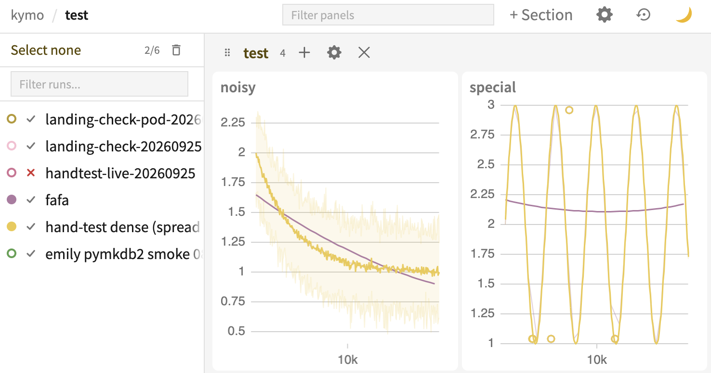

`kymo` is an experiment tracker for machine learning.



- ✅ Correct graphs, unlike the other experiment trackers
- ❌ All webpage viewers have admin access, so you can't show untrusted friends your graphs
- ❌ Vibe-coded. I can't read Rust and don't know Postgres or ClickHouse or webdev. That means I can't read your PRs
- ❌ It's internal tooling. We don't dogfood the local mode
- ❌ Someone decided to coerce all metric (chart) values to fp32, which will be fixed later but maybe not soon

## Setup

You will run your own backend, since I'm too lazy to make money hosting for anyone.

Two options:

- **Local mode** (recommended) runs the backend on your machine. `pip install "kymo[local]"`
- **Hosted mode** logs to a server which you must separately set up; see [self-hosting](docs/self-hosting.md). `pip install kymo`

Python 3.10 or newer. The first time local mode starts, it downloads PostgreSQL and ClickHouse, about 700 MB. Linux x86-64 and Apple Silicon Mac, too bad for Windows users.

## Usage

```python
import numpy as np
import kymo

if __name__ == "__main__":
    kymo.init(mode="local", project_id="demo", run_name="first run", config={"lr": 3e-4})  # Karpathy's favored LR
    for step in range(1000):
        kymo.log({"loss": 1.0 / (step + 1)}, step=step)
    kymo.log({"sample": kymo.Image((127.5 * (1 + np.cos(np.arctan2(*np.mgrid[-1:1:512j, -1:1:512j])[..., None] - np.arange(3) * 2 * np.pi / 3))).astype(np.uint8))}, step=999)
    kymo.open_run()  # opens the dashboard in your browser
    kymo.finish()
```

Keep the `if __name__ == "__main__":` guard. kymo uploads from a helper process, and on macOS that process re-imports your script.

In local mode, the backend autostarts when logged to and stops after an hour idle; logging or viewing will reset the clock. `kymo open` starts it for viewing, since your browser can't autostart it.

The [client README](python_client/README.md) covers the `kymo` commands, remote machines, undelivered data, backups, and logging to a server.

This repository is a mirror of our internal repository. See [CONTRIBUTING](.github/CONTRIBUTING.md).

"kymo" comes from [kymograph](https://en.wikipedia.org/wiki/Kymograph).

## License

Apache-2.0; see [LICENSE](LICENSE) and [NOTICE](NOTICE).
